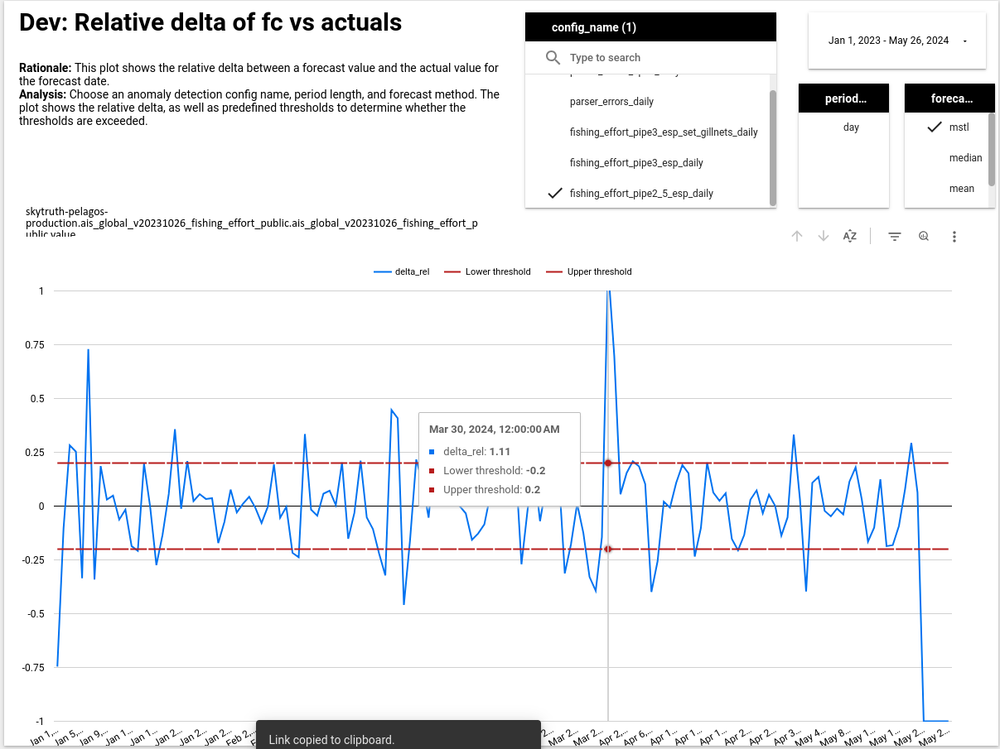

# Workflow
1) Generate forecast for latest day.
2) If delta between actual vs forecast exceeds preset threshold an alert is raised.

# Generating Forecasts

## Usage

### Config
Forecasts are configured in config.yml. There are two modes:
1) Specify date and forecast column
2) Manually specify an SQL script

#1 is only possible, if the source table already has the available columns and allows to SUM/COUNT forecast column and GROUP BY `date_column`. If this is not possible, a custom SQL script can be provided that needs to return 2 columns: `timestamp` and `value`.

### Docker
For production purposes a Dockerfile has been provided.

### R
For development and manually generating forecasts you may use the R project which includes `generate_forecasts.R`, which is a wrapper to quickly generate a full load of forecasts.

# Anomaly Configuration

## Data
Each anomaly configuration requires a unique definition for loading the data. The data definition is uniquely specified by:
 - dataset
 - table
 - timestamp column
 - value column
 - period length

# [Anomaly detection monitoring dashboard](https://lookerstudio.google.com/reporting/1f9b8d37-a87b-4177-a108-3b3e87ce5804)
An dashboard has been created to explore new monitoring opportunities, tweak existing anomaly detection configurations, and debug anomalies after alerts have been triggered.

