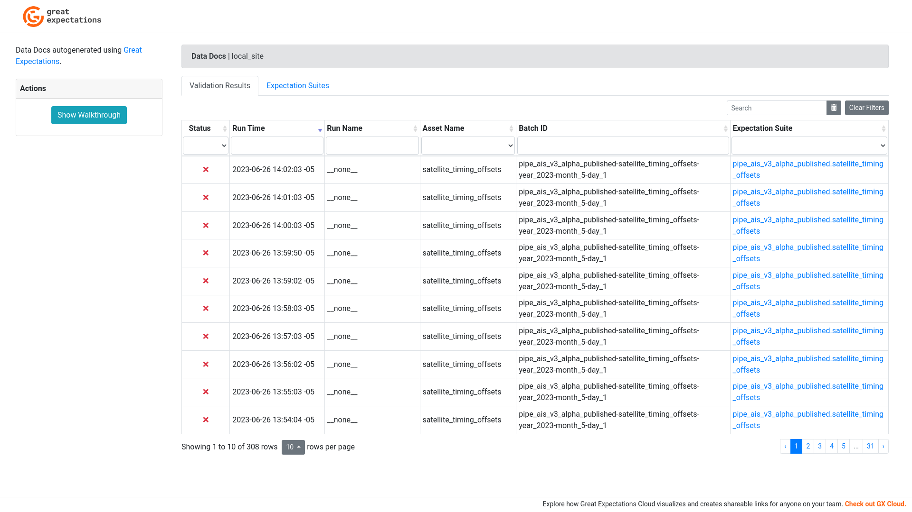

# Great Expectations
Automated data testing using Great Expectations


## Overview
Great Expectations (GX/GE) allows to define expectation suites (a group of tests) in order to validate tables or subsets of tables.

For understanding the different concepts in GX please refer to the [getting started docs](https://docs.greatexpectations.io/docs/guides/setup/get_started_lp).

For getting started with this repository and understanding the workflow, it is crucial to know that everything in GX is defined in YAML config files. GX suggests generating these config files interactively from jupyter notebooks which for now is also the approach we take in [our workflow](#workflow). These config files should never be edited by hand because they might be overwritten. The process of generating these config files is idempotent, so it doesn't matter if we regenerate them multiple times. However, this works in an update-or-insert manner and existing configurations need to be removed manually if no longer needed.

## Usage

```
python3.9 -m venv venv
source venv/bin/activate
pip3 install -r requirements.txt
jupyter-lab
```

## Caveats
See [README](../README.md).

## Workflow
For getting started with this repository and understanding the workflow, it is crucial to know that everything in GX is defined in YAML config files. GX suggests generating these config files interactively from jupyter notebooks which for now is also the approach we take in [our workflow](#workflow).

The overall setup is based on the official GX [getting started docs](https://docs.greatexpectations.io/docs/guides/setup/get_started_lp). It differs mainly in two ways:
1) We need to automatically apply a hack that generates views based on every table we want to test. This is to circumvent the [known issue](https://github.com/great-expectations/great_expectations/issues/1783), that GX is incompatible with BigQuery's partition filter enforcement. The automated fix queries the information schema to determine whether partition filter enforcement is active and what the partition columns are.
2) In order to support multiple versions of the same table, we define a [datasource config](datasources/datasources.yml). When creating GX table assets, we create views for all versions of the same table.

### Create Datasources and Assets
`Datasource`: Container of data assets, e.g. a BigQuery project or dataset.
`Data Asset`: A BigQuery table, view, or SQL query.
The first step when working with GX is creating datasources. In the current setup, this is 100% automated and based on [datasource config](datasources/datasources.yml).

### Create Expectation Suites
`Expectation Suite`: A container that groups multiple expectations. An expectation suite usually maps 1:1 to a table version or table.
After creating datasources and assets, expectation suites need to be created as containers to group multiple expectations. While one expectation suite can principally be run on multiple tables, we currently create one expectation suite per table version. This is subject to change in the future.

Just like creating datasources, this step is 100% automated and based on [datasource config](datasources/datasources.yml).

### Create Expectations
`Expectation`: Basically the same as an assertion in testing.
This is the manual step of the test development workflow. For each table (optionally table version) a jupyter notebook should be created that generates the expectations for that table. Developing these tests in an interactive manner allows to validate during development, whether the assertions are valid. By default, only expectations that pass the validation are materialised in YAML configs. It is suggested to change this behaviour though by setting `discard_failed_expectations=False` when calling `gx_validator.save_expectation_suite`.

### Create Checkpoint
`Checkpoint`: A checkpoint maps an expectation suite to a data asset (or more specifcally to batch of a data asset).
Just like the previous step of creating expectations, a checkpoint must be created manually for every table, although this might be automated in the future. This part of the workflow has two components.

#### Create Static Checkpoint
Some of the configuration of a checkpoint is static, like the expectation suite to which it as attached and the actions to run as part of the checkpoint. These parameters are set for each expectation suite (table version) in a jupyter notebook.

#### Define Checkpoint Runtime
The idea of checkpoints is to run them against different batches of a table, e.g. the current date, a specific year, or the entire table. This configuration should be set during the runtime when triggering a test, e.g. from Airflow. Therefore, the batch definition is set e.g. in an Airflow dag which can take a parameter to determine which batch the checkpoint should be run against.


## Data Doc sample


